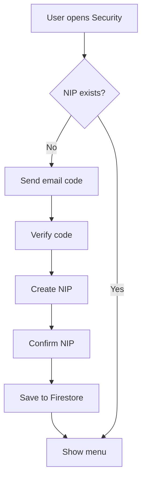
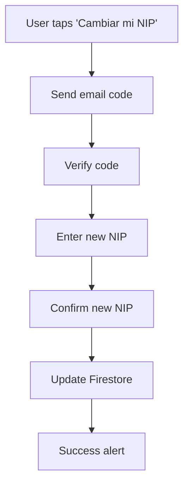
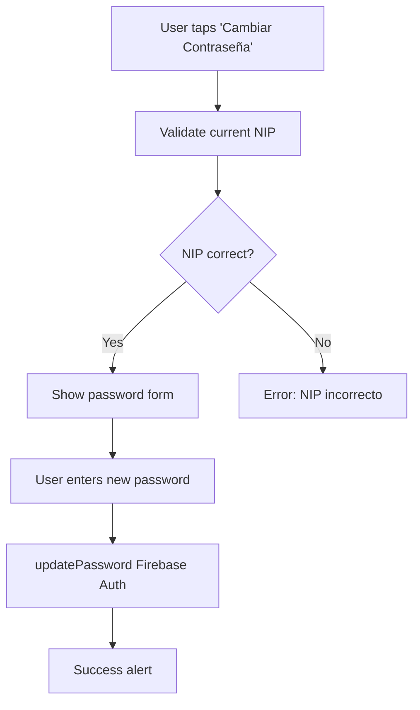

The `useSeguridad` hook manages all security-related functionality including security PIN (NIP) creation/modification, password changes, and biometric authentication (Face ID/Touch ID/Fingerprint).

## Overview

This hook provides comprehensive account security management:
- Create and validate 4-digit security PIN (NIP)
- Change existing PIN with email verification
- Update Firebase Authentication password
- Enable/disable biometric authentication
- Multi-step security flows with email verification

<Info>
The security PIN is separate from the login password and is used for sensitive operations like creating payment cards and confirming reservations.
</Info>

## Import

```typescript
import { useSeguridad } from '@/hooks/useSeguridad';
```

## Usage

```typescript
const {
  step,
  emailCodeInput,
  setEmailCodeInput,
  generatedCode,
  isLoading,
  nip,
  userEmail,
  biometricsEnabled,
  isBiometricSupported,
  newPasswordText,
  setNewPasswordText,
  handleSendCode,
  verifyEmailCode,
  handlePressNumber,
  handleDelete,
  toggleBiometrics,
  router,
  startChangeNipProcess,
  handleRecoverNip,
  startChangePasswordProcess,
  handleUpdatePassword
} = useSeguridad();
```

## State Values

<ParamField path="step" type="Step">
  Current step in the security flow:
  - `'loading'` - Initial load, checking NIP existence
  - `'menu'` - Main security menu (NIP exists)
  - `'verify_email'` - Email verification for new NIP
  - `'create_nip'` - Creating new NIP
  - `'confirm_nip'` - Confirming new NIP
  - `'validate_nip_for_pass'` - Validating NIP before password change
  - `'change_password'` - Password change form
</ParamField>

<ParamField path="emailCodeInput" type="string">
  User input for 6-digit email verification code
</ParamField>

<ParamField path="generatedCode" type="string | null">
  Generated 6-digit verification code sent to user's email
</ParamField>

<ParamField path="isLoading" type="boolean">
  Loading state for async operations
</ParamField>

<ParamField path="nip" type="string[]">
  Array of 4 digits representing the security PIN (e.g., `['1', '2', '3', '4']`)
</ParamField>

<ParamField path="userEmail" type="string">
  Current user's email address from Firebase Auth
</ParamField>

<ParamField path="biometricsEnabled" type="boolean">
  Whether biometric authentication is enabled for this user
</ParamField>

<ParamField path="isBiometricSupported" type="boolean">
  Whether device supports biometric authentication (hardware + enrollment check)
</ParamField>

<ParamField path="newPasswordText" type="string">
  New password input for password change flow
</ParamField>

## Functions

### handleSendCode

Generates and sends a 6-digit verification code to user's email.

```typescript
const handleSendCode = async () => Promise<void>
```

**Process:**
1. Generates random 6-digit code
2. Sends email via EmailJS with template
3. Stores code in `generatedCode` state
4. Shows success/error alert

**EmailJS Configuration:**
```typescript
Service ID: 'service_ov1txor'
Template ID: 'template_tn3fdwk'
Public Key: 'uwyrohVqlzvgOj1KT'
```

**Email Template Variables:**
```typescript
{
  to_email: userEmail,
  user_name: userName,
  verification_code: generatedCode
}
```

---

### verifyEmailCode

Validates the email verification code entered by user.

```typescript
const verifyEmailCode = () => void
```

**Behavior:**
- Compares `emailCodeInput` with `generatedCode`
- If match → advances to `'create_nip'` step
- If no match → shows error alert

---

### handlePressNumber

Adds a digit to the current NIP input.

```typescript
const handlePressNumber = (num: string) => void
```

<ParamField path="num" type="string" required>
  Digit to add (0-9)
</ParamField>

**Logic:**
- Finds first empty slot in `nip` array
- Fills with the pressed number
- Auto-advances to confirmation when 4 digits entered

**Example:**
```typescript
<TouchableOpacity onPress={() => handlePressNumber('5')}>
  <Text>5</Text>
</TouchableOpacity>
```

---

### handleDelete

Removes the last digit from NIP input.

```typescript
const handleDelete = () => void
```

Clears the rightmost non-empty digit in the `nip` array.

---

### toggleBiometrics

Enables or disables biometric authentication.

```typescript
const toggleBiometrics = async () => Promise<void>
```

**Enable Flow:**
1. Prompts biometric authentication (`LocalAuthentication.authenticateAsync`)
2. If successful → sets `biometricsEnabled` to `true`
3. Updates Firestore: `users/[uid]/biometricsEnabled = true`
4. Shows success alert

**Disable Flow:**
1. Sets `biometricsEnabled` to `false`
2. Updates Firestore immediately
3. No authentication required to disable

<Tip>
Biometric authentication is checked at initialization using `expo-local-authentication`:
```typescript
const compatible = await LocalAuthentication.hasHardwareAsync();
const enrolled = await LocalAuthentication.isEnrolledAsync();
```
</Tip>

---

### startChangeNipProcess

Initiates the NIP change workflow.

```typescript
const startChangeNipProcess = () => void
```

**Steps:**
1. Sends email verification code
2. User enters code
3. User enters new NIP
4. User confirms new NIP
5. NIP saved to Firestore

---

### handleRecoverNip

Handles NIP recovery (same as change, but for forgotten NIP).

```typescript
const handleRecoverNip = async () => Promise<void>
```

Sends recovery email and starts verification flow.

---

### startChangePasswordProcess

Initiates password change workflow.

```typescript
const startChangePasswordProcess = () => void
```

**Steps:**
1. User validates current NIP
2. If valid → shows password change form
3. User enters new password (min 6 characters)
4. Password updated via Firebase Auth

---

### handleUpdatePassword

Updates the user's Firebase Authentication password.

```typescript
const handleUpdatePassword = async () => Promise<void>
```

**Validation:**
- Password must be at least 6 characters
- Uses Firebase `updatePassword()` function

**Error Handling:**
If user's session is too old, Firebase may require re-authentication:
```
Error: "No se pudo actualizar. Es posible que debas iniciar sesión nuevamente."
```

<Warning>
Password changes affect Firebase Authentication directly. Users must use the new password on next login.
</Warning>

## Complete Example

```typescript SeguridadScreen.tsx
import { useSeguridad } from '@/hooks/useSeguridad';

export default function SeguridadScreen() {
  const {
    step,
    nip,
    biometricsEnabled,
    isBiometricSupported,
    handlePressNumber,
    handleDelete,
    toggleBiometrics,
    startChangeNipProcess,
    startChangePasswordProcess
  } = useSeguridad();

  if (step === 'menu') {
    return (
      <View>
        {/* Biometric Toggle */}
        {isBiometricSupported && (
          <View>
            <Text>Usar Face ID / Touch ID</Text>
            <Switch
              value={biometricsEnabled}
              onValueChange={toggleBiometrics}
            />
          </View>
        )}

        {/* Change NIP */}
        <TouchableOpacity onPress={startChangeNipProcess}>
          <Text>Cambiar mi NIP</Text>
        </TouchableOpacity>

        {/* Change Password */}
        <TouchableOpacity onPress={startChangePasswordProcess}>
          <Text>Cambiar Contraseña</Text>
        </TouchableOpacity>
      </View>
    );
  }

  if (step === 'create_nip') {
    return (
      <View>
        <Text>Crea tu NIP de 4 dígitos</Text>
        
        {/* NIP Display */}
        <View style={{ flexDirection: 'row' }}>
          {nip.map((digit, i) => (
            <View key={i}>
              <Text>{digit || '·'}</Text>
            </View>
          ))}
        </View>

        {/* Numeric Keypad */}
        <View>
          {[1, 2, 3, 4, 5, 6, 7, 8, 9, 0].map(num => (
            <TouchableOpacity
              key={num}
              onPress={() => handlePressNumber(num.toString())}
            >
              <Text>{num}</Text>
            </TouchableOpacity>
          ))}
          <TouchableOpacity onPress={handleDelete}>
            <Text>⌫</Text>
          </TouchableOpacity>
        </View>
      </View>
    );
  }

  return null;
}
```

## Firebase Structure

### users Collection

```typescript
{
  "users": {
    "[uid]": {
      "securityNip": "1234",
      "biometricsEnabled": true
    }
  }
}
```

<Note>
The NIP is stored as plain text in Firestore since it's not used for authentication, only for operation confirmation. For production, consider hashing the NIP.
</Note>

## Security Flows

### First-Time NIP Creation



### Change Existing NIP



### Change Password



## Platform Support

| Feature | iOS | Android | Web |
|---------|-----|---------|-----|
| Face ID | ✅ | N/A | N/A |
| Touch ID | ✅ | N/A | N/A |
| Fingerprint | N/A | ✅ | N/A |
| NIP | ✅ | ✅ | ✅ |
| Password | ✅ | ✅ | ✅ |

## Related

- [User Profile Feature](/features/user-profile) - Account settings
- [useLogin Hook](/development/hooks/use-login) - Authentication
- [Payment Methods Guide](/guides/payment-methods) - NIP used for card creation
