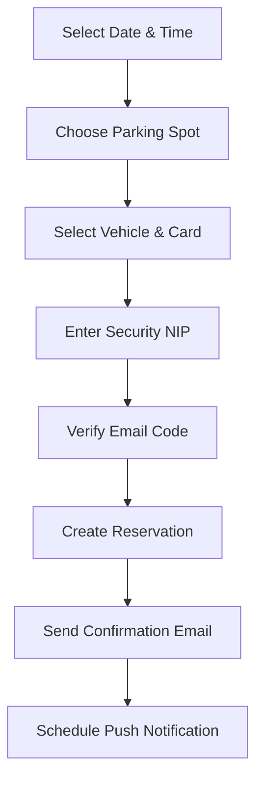

## Overview

The reservation system allows users to book parking spots in advance with real-time availability tracking, secure payment processing, and automated email confirmations. Reservations can be made up to 4 days in advance with flexible time slots.

## Creating a Reservation

### Step 1: Select Date and Time

Users can choose their reservation date and time using native date/time pickers:

<Steps>
  <Step title="Choose Date">
    Select a date up to 4 days in advance. Past dates are automatically blocked.
  </Step>
  <Step title="Choose Time">
    Select a time slot between 7:00 AM and 11:00 PM. Hours outside this range are blocked.
  </Step>
</Steps>

<Note>
  Reservations cannot be made for past dates or times. The system enforces a 4-day advance booking limit.
</Note>

### Step 2: Select Parking Spot

The interactive parking map displays 10 available spots in real-time:

- **Green spots**: Available for booking
- **Red spots**: Currently occupied
- **Yellow spots**: Your selection

```typescript
// Real-time occupied spots tracking
const [occupiedSpots, setOccupiedSpots] = useState<string[]>([]);

useEffect(() => {
    const q = query(
        collection(db, "reservations"), 
        where("status", "in", ["active", "pending"])
    );
    const unsubscribe = onSnapshot(q, (snapshot) => {
        const occupied: string[] = [];
        snapshot.forEach((doc) => { 
            if (doc.data().spotId) occupied.push(doc.data().spotId.toString());
        });
        setOccupiedSpots(occupied);
    });
    return () => unsubscribe();
}, []);
```

### Step 3: Select Vehicle and Payment Method

Users must select:
- A registered vehicle from their garage
- A payment card from their wallet

<Warning>
  Both a vehicle and payment method are required to proceed with the reservation.
</Warning>

### Step 4: Security Verification

The reservation process includes two-factor authentication:

<Accordion title="NIP Verification">
  Users enter their 4-digit security PIN to authorize the reservation.
  
  ```typescript
  // NIP validation
  const uSnap = await getDoc(doc(db, "users", auth.currentUser!.uid));
  if (uSnap.data()?.securityNip !== nip.join('')) {
      Alert.alert("NIP Incorrecto");
      return;
  }
  ```
</Accordion>

<Accordion title="Email Code Verification">
  After NIP validation, a 4-digit code is sent to the user's email:
  
  ```typescript
  const code = Math.floor(1000 + Math.random() * 9000).toString();
  await emailjs.send(
      EMAILJS_SERVICE_ID, 
      EMAILJS_TEMPLATE_ID, 
      { 
          to_email: userEmail, 
          to_name: userName, 
          message: code
      }
  );
  ```
</Accordion>

### Step 5: Confirmation

Once the email code is verified, the reservation is created:

```typescript
await runTransaction(db, async (transaction) => {
    const reservationRef = doc(db, "reservations", reservationID);
    const resDoc = await transaction.get(reservationRef);
    
    if (resDoc.exists()) throw "Lugar ocupado.";
    
    transaction.set(reservationRef, {
        clientId: auth.currentUser!.uid,
        startTime: startTime,
        spotId: selectedSpot,
        vehicleId: selectedVehicle.id,
        cardId: selectedCard.id,
        vehiclePlate: selectedVehicle.plate,
        cardLast4: selectedCard.last4,
        status: "pending",
        createdAt: new Date(),
        date: displayDate,
        time: displayTime,
        customId: reservationID
    });
});
```

## Reservation Workflow



## Reservation States

Reservations progress through the following states:

| State | Description |
|-------|-------------|
| `pending` | Reservation created, waiting for start time |
| `active` | User has checked in at the parking spot |
| `inactive` | Reservation completed |

## Credit Requirements

<Card title="Minimum Balance" icon="wallet">
  Users must maintain a minimum balance of **120 credits** to create a reservation.
  
  ```typescript
  const SALDO_MINIMO = 120;
  
  if (currentCredits < SALDO_MINIMO) {
      Alert.alert("Saldo Insuficiente");
      return;
  }
  ```
</Card>

## Push Notifications

Users receive an automated reminder 15 minutes before their reservation starts:

```typescript
const programarRecordatorio = async (fechaInicio: Date) => {
    const triggerDate = new Date(fechaInicio.getTime() - 15 * 60 * 1000);
    const diffInSeconds = Math.floor((triggerDate.getTime() - now.getTime()) / 1000);
    
    await Notifications.scheduleNotificationAsync({
        content: {
            title: "⏳ Tu reserva está por iniciar",
            body: `Faltan 15 min para tu reserva en el cajón ${selectedSpot}`,
            sound: true,
        },
        trigger: {
            type: 'timeInterval',
            seconds: diffInSeconds,
            repeats: false,
        }
    });
};
```

## Business Rules

<AccordionGroup>
  <Accordion title="Booking Window">
    - Minimum: Current time + operating hours
    - Maximum: 4 days in advance
    - Operating hours: 7:00 AM - 11:00 PM
  </Accordion>
  
  <Accordion title="Payment Processing">
    - Credits are reserved upon reservation creation
    - Final charge applied when reservation becomes active
    - Penalties may apply for no-shows or violations
  </Accordion>
  
  <Accordion title="Cancellation Policy">
    Reservations can be edited or canceled from the "My Reservations" screen before the start time.
  </Accordion>
</AccordionGroup>

## Email Confirmation

After successful creation, users receive a confirmation email with:

- Reservation ID
- QR code for entry
- Date and time
- Parking spot number
- Vehicle plate
- Payment card last 4 digits

<Check>
  The QR code can be scanned at the parking entrance for automatic check-in.
</Check>