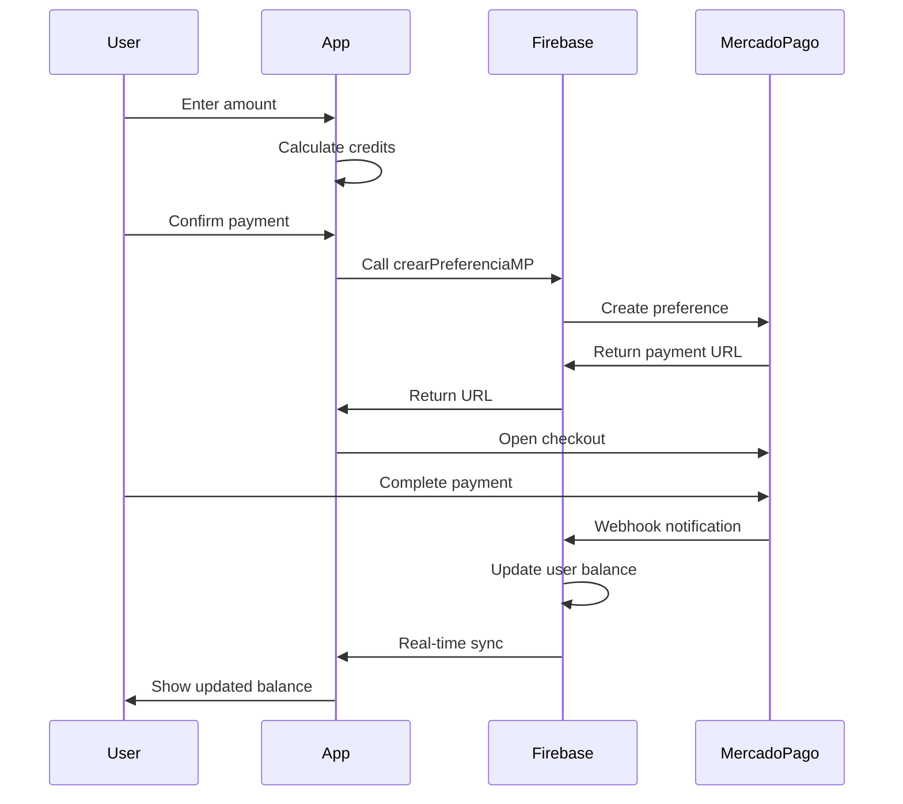

## Overview

The digital wallet system manages user credit balances, payment processing through Mercado Pago, and transaction history. Credits are used for parking reservations with automatic conversion rates and bonus rewards.

## Credit System

### Balance Display

The wallet displays the current credit balance in real-time:

```typescript
const [saldoCreditos, setSaldoCreditos] = useState(0);

useEffect(() => {
  if (!user) return;
  
  const unsub = onSnapshot(
    doc(db, 'users', user.uid), 
    (docSnap) => {
      if (docSnap.exists()) {
        setSaldoCreditos(docSnap.data().credits_balance || 0);
      }
    }
  );
  
  return () => unsub();
}, [user]);
```

<Card title="Real-Time Sync" icon="arrows-rotate">
  Balance updates instantly across all devices using Firebase real-time listeners.
</Card>

### Minimum Balance Requirement

Reservations require a minimum credit balance:

```typescript
const SALDO_MINIMO = 120;

if (currentCredits < SALDO_MINIMO) {
  Alert.alert(
    "Saldo Insuficiente",
    "Necesitas al menos 120 créditos para hacer una reserva."
  );
  return;
}
```

<Warning>
  Users cannot create reservations if their balance falls below 120 credits.
</Warning>

## Recharge Process

### Step 1: Enter Amount

Users can enter any amount or use quick select buttons:

```typescript
<View style={styles.inputContainer}>
  <Text style={styles.currencySymbol}>$</Text>
  <TextInput 
    style={styles.amountInput}
    placeholder="0"
    keyboardType="numeric"
    value={monto}
    onChangeText={setMonto}
    maxLength={5}
  />
  <Text style={styles.currencyCode}>MXN</Text>
</View>

<View style={styles.quickButtonsRow}>
  {[30, 50, 100].map((val) => (
    <TouchableOpacity 
      key={val} 
      style={styles.quickBtn} 
      onPress={() => setMonto(val.toString())}
    >
      <Text style={styles.quickBtnText}>${val}</Text>
    </TouchableOpacity>
  ))}
</View>
```

<Info>
  The minimum recharge amount is **$30.00 MXN**.
</Info>

### Step 2: Credit Conversion

Money is automatically converted to credits with bonus rewards:

```typescript
useEffect(() => {
  const dinero = parseFloat(monto);
  if (isNaN(dinero)) {
    setCreditosPreview(0);
    return;
  }
  
  let creditos = dinero * 6;  // Base rate: $1 = 6 credits
  
  // Bonus for purchases of 100+ credits
  if (creditos >= 100) {
    creditos += 20;
  }
  
  setCreditosPreview(Math.floor(creditos));
}, [monto]);
```

#### Conversion Rate

| Amount (MXN) | Credits | Bonus | Total |
|--------------|---------|-------|-------|
| $30 | 180 | 0 | 180 |
| $50 | 300 | 0 | 300 |
| $20 (100+ credits) | Base | +20 | Base + 20 |

<Accordion title="Bonus Display">
  ```typescript
  {creditosPreview >= 100 && monto !== '' && (
    <View style={styles.bonusBadge}>
      <Text style={styles.bonusText}>
        ¡Incluye +20 Créditos de regalo! 🎉
      </Text>
    </View>
  )}
  ```
</Accordion>

### Step 3: Payment Processing

Payments are processed through Mercado Pago integration:

```typescript
const iniciarRecarga = async () => {
  const dinero = parseFloat(monto);

  if (isNaN(dinero) || dinero < 30) {
    Alert.alert("Monto Inválido", "La recarga mínima es de $30.00 MXN");
    return;
  }

  const usuarioFresco = auth.currentUser;
  if (!usuarioFresco) {
    Alert.alert("Error de Sesión", "No se detecta el usuario.");
    return;
  }

  setLoadingPago(true);
  
  try {
    const crearPreferencia = httpsCallable(functions, 'crearPreferenciaMP');
    
    const resultado: any = await crearPreferencia({ 
      monto: dinero,
      uid: usuarioFresco.uid 
    });

    const datos = resultado.data;

    if (datos.success === false) {
      Alert.alert("Error del Servidor", datos.message);
      return;
    }
    
    const urlPago = datos.url;
    
    if (urlPago) {
      Linking.openURL(urlPago);
    }
  } catch (error: any) {
    Alert.alert("Error de Conexión", error.message);
  } finally {
    setLoadingPago(false);
  }
};
```

<Steps>
  <Step title="Create Payment Preference">
    Call Firebase Cloud Function to create Mercado Pago preference
  </Step>
  <Step title="Open Payment URL">
    Launch Mercado Pago checkout in device browser
  </Step>
  <Step title="Process Payment">
    Mercado Pago handles the payment flow
  </Step>
  <Step title="Webhook Notification">
    Server receives webhook and updates user balance
  </Step>
</Steps>

## Payment Card Display

The wallet shows linked payment cards:

```typescript
<View style={styles.cardInfo}>
  <Ionicons name="card-outline" size={18} color="#AAA" />
  <Text style={styles.cardText}>
    Vinculado a Tarjeta Titular •••• {tarjetaTitular || '----'}
  </Text>
</View>
<Text style={styles.cardSubText}>
  Este saldo se comparte con todas tus tarjetas asociadas.
</Text>
```

### Primary Card Detection

```typescript
useEffect(() => {
  const fetchCard = async () => {
    if (!user) return;
    try {
      const q = query(
        collection(db, 'users', user.uid, 'cards'),
        where('isPrimary', '==', true)
      );
      const snap = await getDocs(q);
      if (!snap.empty) {
        const cardData = snap.docs[0].data();
        setTarjetaTitular(cardData.last4 || '****');
      }
    } catch (error) {
      console.log("Error loading card");
    }
  };
  fetchCard();
}, [user]);
```

## Balance Card Design

The wallet features a premium dark card design:

```typescript
<View style={styles.balanceCard}>
  <View style={styles.balanceHeader}>
    <Text style={styles.balanceLabel}>SALDO DISPONIBLE</Text>
    <Ionicons name="wallet" size={24} color="#FFE100" />
  </View>
  
  <Text style={styles.balanceAmount}>{saldoCreditos}</Text>
  <Text style={styles.balanceUnit}>CRÉDITOS</Text>
  
  <View style={styles.divider} />
  
  <View style={styles.cardInfo}>
    <Ionicons name="card-outline" size={18} color="#AAA" />
    <Text style={styles.cardText}>
      Vinculado a Tarjeta Titular •••• {tarjetaTitular || '----'}
    </Text>
  </View>
</View>
```

### Styling

```typescript
balanceCard: {
  backgroundColor: '#1a1a1a',
  borderRadius: 20,
  padding: 25,
  marginBottom: 30,
  shadowColor: "#000",
  shadowOffset: { width: 0, height: 5 },
  shadowOpacity: 0.3,
  elevation: 8
}
```

<Tip>
  The dark theme creates a premium feel and improves text contrast for the yellow accent colors.
</Tip>

## Transaction Flow



## Credit Usage

Credits are deducted during reservation confirmation:

```typescript
// Reservations require minimum balance check
if (currentCredits < SALDO_MINIMO) {
  Alert.alert(
    "Saldo Insuficiente",
    `Necesitas al menos ${SALDO_MINIMO} créditos. Tu saldo actual: ${currentCredits}"
  );
  return;
}

// Credit deduction happens server-side when reservation activates
```

<Warning>
  Credit deductions are processed atomically using Firebase transactions to prevent race conditions.
</Warning>

## Shared Balance

<Card title="Multi-Card Support" icon="credit-card">
  The credit balance is shared across all payment cards linked to the account. Users don't need to maintain separate balances for each card.
</Card>

## Payment Security

<AccordionGroup>
  <Accordion title="Mercado Pago Integration">
    All payments are processed through Mercado Pago's secure platform. The app never handles sensitive card information.
  </Accordion>
  
  <Accordion title="Server-Side Processing">
    Payment preferences are created server-side via Firebase Cloud Functions to protect API credentials.
  </Accordion>
  
  <Accordion title="Webhook Verification">
    Server validates webhook signatures from Mercado Pago before updating user balances.
  </Accordion>
</AccordionGroup>

## Error Handling

```typescript
try {
  const resultado = await crearPreferencia({ monto: dinero, uid: userId });
  
  if (resultado.data.success === false) {
    Alert.alert(
      "Error del Servidor", 
      resultado.data.message + "\n" + (resultado.data.details || '')
    );
    return;
  }
  
  Linking.openURL(resultado.data.url);
} catch (error: any) {
  Alert.alert("Error de Conexión", error.message);
}
```

<Check>
  Comprehensive error handling provides clear feedback for connection issues, server errors, and validation failures.
</Check>